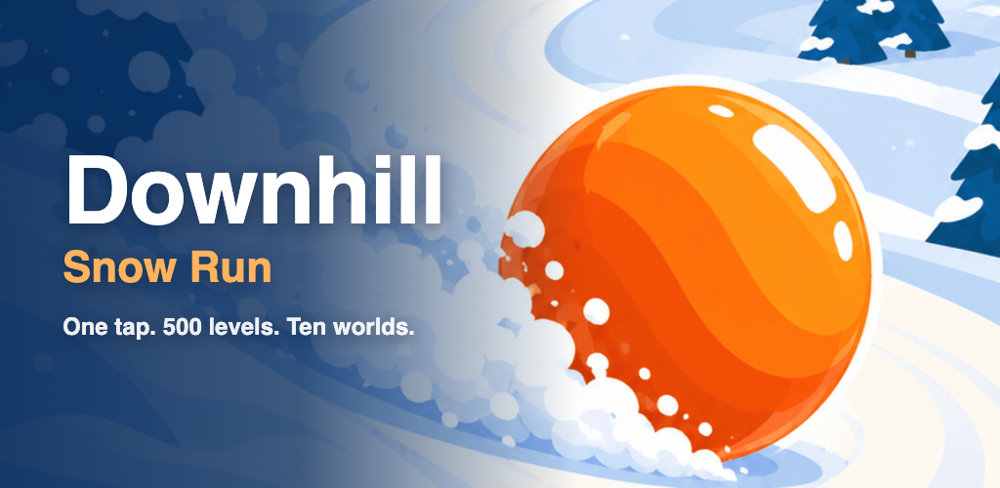

<p align="center">
  
</p>

# Downhill: Snow Run

A one-tap ski game for iPhone and Android. Tap anywhere to switch the way you carve, weave between the trees and reach the finish tape. It is easy to pick up and hard to put down.

**Coming soon to the App Store and Google Play.**

## How to play

- **Tap** to switch between carving left and carving right. That is the only control.
- **Stay on the piste** and dodge everything the mountain throws at you.
- **Reach the finish tape** to clear the level and unlock the next one.

## What's inside

**500 levels across ten worlds.** Ski from Pine Valley through Larch Ridge, Whiteout Pass, Glacier Run, Alpenglow Ridge, Aurora Peak, Frozen Lake, Lantern Village and Basalt Springs, all the way to Summit Crown. Each world has its own look on the map.

**A mountain that fights back.** The first runs are just you and the snow. Then the slope fills up with slalom gates, snowmen, boulders, jumps, logs and nets, other skiers and sledding kids, snowmobiles, wolves, foxes, deer and bears, toppling trees, rolling snowballs and falling icicles. Each one arrives slowly, so there is always time to learn it.

**Power-ups.** A Helmet survives one crash, Ghost lets you pass straight through trouble, and ×2 doubles your points.

**Score and combos.** Skim close past trees and hazards to build a combo, and every near miss in a row pays more. Replay any level to beat your best. Only your better result is kept.

## Privacy

No internet needed, no ads, no accounts and no tracking. Your progress stays on your phone. Read the full [privacy policy](store/privacy-policy.md).

## Support

Found a bug or have an idea? Email [app.filip.vitas@gmail.com](mailto:app.filip.vitas@gmail.com).

## For developers

The game is written in TypeScript and drawn on a canvas, then wrapped for iOS and Android with [Capacitor](https://capacitorjs.com).

```sh
pnpm install
pnpm dev        # play it in the browser
pnpm ios        # open the iOS project in Xcode
pnpm android    # open the Android project in Android Studio
```

The release checklist and store listings are in [store/README.md](store/README.md).

## License

Copyright © 2026 Filip Vitas. All rights reserved. The source is public to read, not to reuse: see [LICENSE](LICENSE).
